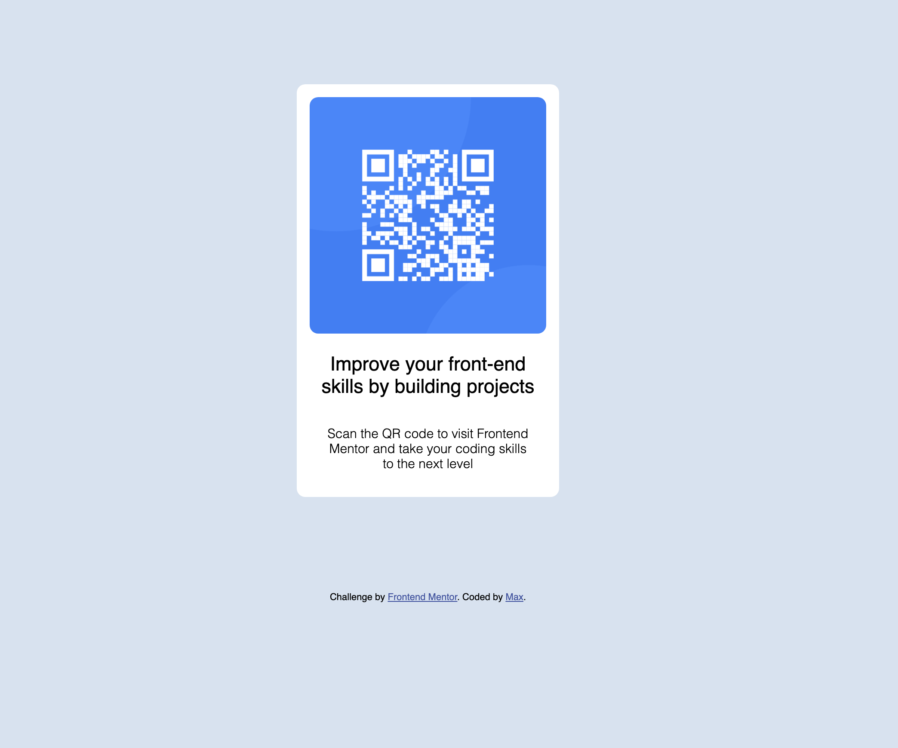

# Frontend Mentor - QR code component solution

This is a solution to the [QR code component challenge on Frontend Mentor](https://www.frontendmentor.io/challenges/qr-code-component-iux_sIO_H). Frontend Mentor challenges help you improve your coding skills by building realistic projects. 

## Table of contents

- [Overview](#overview)
  - [Screenshot](#screenshot)
  - [Links](#links)
- [My process](#my-process)
  - [Built with](#built-with)
  - [What I learned](#what-i-learned)
- [Author](#author)

### Screenshot

### Links

- Solution URL: (https://github.com/maxkaiser100/qrcode.git)

## My process

I first drew out on paper what the boxing would need to be, then implemented.

### Built with

- Semantic HTML5 markup
- CSS custom properties
- Flexbox
- Mobile-first workflow

### What I learned

More about using Flexbox.

### Continued development

I'm struggling with how to make the container align vertically. I had to force in a height to make it do this and I'm sure that's not the right way. Without a forced height, align-items didn't do anything.

## Author

- Frontend Mentor - @maxkaiser100

## Acknowledgments

